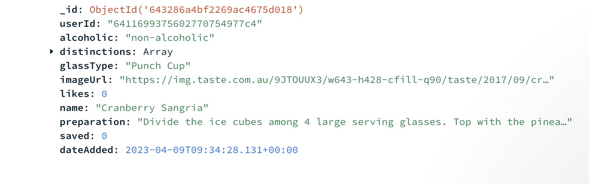
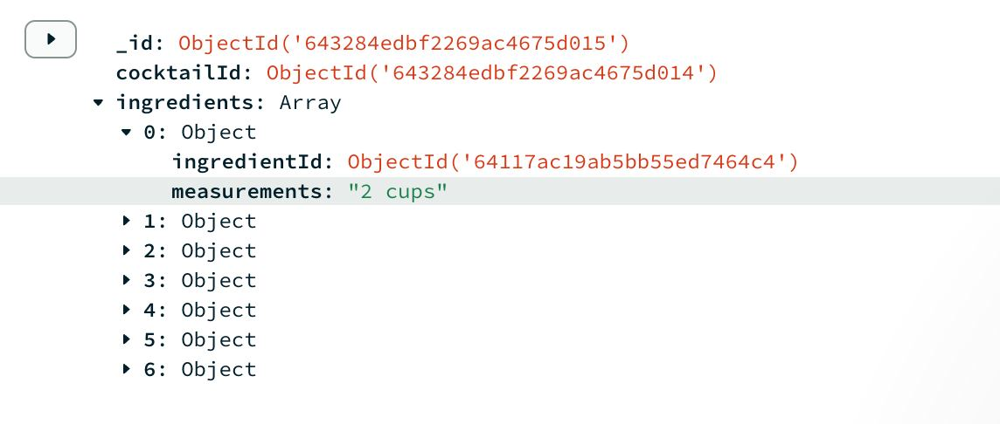
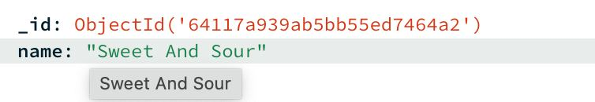

# Cocktail Central API

## Database Structure

### Cocktail Collection
```
  GET /cocktails/
```
| Parameter | Type     | Description                |
| :-------- | :------- | :------------------------- |
| `-` | `-` | **No parameter required** |


#### The data structure of the Cocktail collection is as shown below



### Ingredient Usage Collection
```
  GET /cocktails/ingredients-used
```
| Parameter | Type     | Description                |
| :-------- | :------- | :------------------------- |
| `-` | `-` | **No parameter required** |

#### The data structure of the Ingredient Usage collection is as shown below



### Ingredient Collection
```
  GET /cocktails/ingredients
```

| Parameter | Type     | Description                |
| :-------- | :------- | :------------------------- |
| `-` | `-` | **No parameter required** |


#### The data structure of the Ingredient collection is as shown below


